## Hi there 👋

<h3 align="left"> 📫 Contacts:</h3>
- Email: artemmufazalov6197@gmail.com  
- Telegram: <a href="https://t.me/artemmufazalov" alt="Telegram">@artemmufazalov</a>

<h3 align="left"> ⚡Languages and Tools:</h3>

---

<!--  -->

---

---

<!-- my-badges start -->

<!-- my-badges end -->
